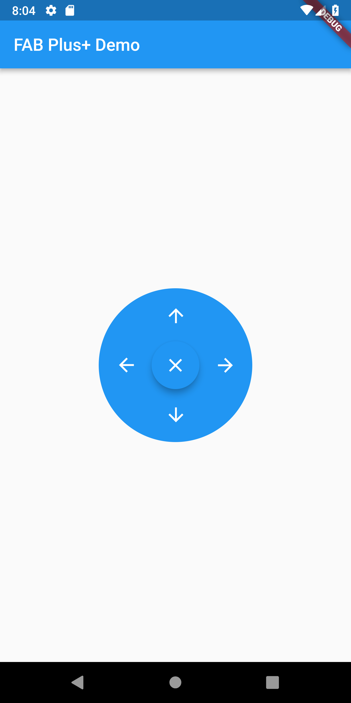
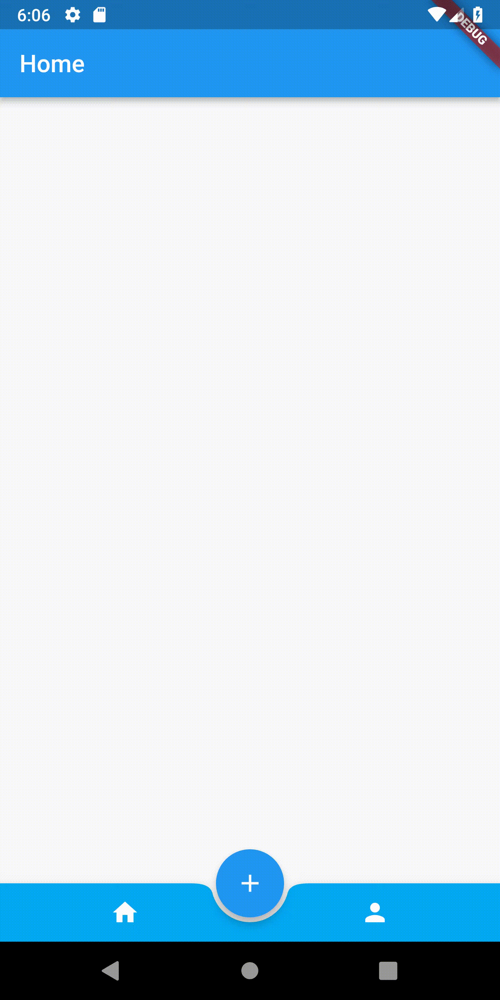

# Flutter-Widgets
*** flutter 组件，方便日常开发 ***

# [Floating Action Button Demo](https://github.com/BeanWei/Flutter-Widgets/tree/master/floating_action_button_demo)
## 介绍
以圆盘的方式扩展浮动按钮，类似于安卓小白点。

## 截图

    
    

# Popup Window MenuBar Demo
## 介绍
弹出式菜单，利用Flutter的Dialog。

## 截图

    

